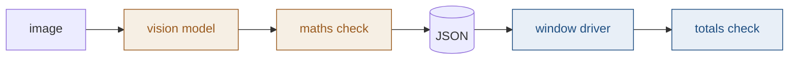

# Image to Fakturama

An order arrives as a picture. It has to end up as a saved order and a paid invoice
in Fakturama, with nothing typed by hand and nothing guessed.

Two halves, one JSON file between them, one rule: **prove it or stop.**

---

## 1. Problem

Someone gets an order as an image and retypes it into Fakturama: the customer, each
product, the quantities, the discounts, the tax. It is slow, and a single wrong digit
becomes a wrong invoice. The work splits into two problems that have almost nothing
in common.

### 1.a Reading the image

- An image is pixels. None of it is data yet.
- **Digits get misread.** A 3 can look like an 8. Nothing about a wrong number looks wrong.
- **The same word means two things.** The "Customer ID" printed on the page is not
  Fakturama's own customer ID. The price on an order line is not the product's own
  price. Mixing them up is easy and silent.
- **Missing is not the same as zero.** "This order has no discount" and "we could not
  read the discount" have to stay apart, or we write a number the document never said.
- Dates and currency depend on the page. `01/02/2026` is two different days.

### 1.b Filling Fakturama

- Fakturama is a Java desktop app. There is no API to send an order to, so the only
  way in is the window itself: click, type, read.
- **The app barely describes itself.** Table rows are drawn as pictures, not real
  controls, so there is nothing to read. Field IDs change every time the app starts,
  so they cannot be saved and reused.
- **A wrong click does not complain.** Land one row off and the app happily accepts
  it. You get a clean-looking order for the wrong product.
- Typing changes the screen. Filtering a list rebuilds it, and what you were holding
  is gone mid-step.
- Error boxes stack up and block everything behind them, including the tooltips we
  rely on.

---

## 2. Solution

Two halves that never touch, with one JSON file between them. The read half can be
tested with no Fakturama running; the write half can be built against a saved file
with no API calls. When something breaks, the file says which half to look at.

### 2.a Reading the image

- **The model copies, it does not think.** It reads the page in the page's own words
  and is told not to do maths and not to fix anything it thinks is wrong.
- **Python does the maths, then checks its own answer.** Line by line, then net, tax
  and gross, against the totals the document itself prints. Two separate paths to the
  same numbers.
- **If they disagree, we stop.** No file is written and nothing reaches Fakturama. A
  misread digit inside an accounting system is worse than a failed run.
- Anything absent is written as an explicit `null`, so "not stated" never turns into 0.
- All money is `Decimal`. Never `float` — it invents one-cent errors in exactly these sums.

> Because the maths check catches misreads, the cheap vision model is good enough.
> The safety net is arithmetic, not the model.

### 2.b Filling Fakturama

- **Every field is named in one list.** The code asks for `order.date`, not for a
  control. When the app changes, one row in the list changes.
- **Three ways to find a field, in order:** its own name, then its tooltip, then its
  place in the layout. Later ways are weaker, so the run says which one it used.
- **Nothing is trusted after writing.** Every value is read back. Table rows are read
  by copying the table to the clipboard, because the rows themselves cannot be read.
- **Where we must click, we prove where we landed.** The cell is opened, its current
  value is compared with what that row should hold, and only then is anything typed.
- **Move by keyboard, not by pixels.** One click puts us on the first row; arrow keys
  reach the rest. Guessing a row height silently books row 2 into row 1.
- **The last check is the point.** Fakturama adds up the order itself. Those totals
  must match the ones we computed from the image. Same three numbers, two unrelated
  routes.
- Any step that cannot be proved stops the run and says which step and why. A
  half-filled order that saved is worse than no order.

---

## 3. What could be improved?

- **Go around the window.** Writing to Fakturama's database directly would be faster
  and far safer than driving the screen. Worth checking whether its file format is
  documented.
- **It needs the screen.** The app has to be open and in front, so nobody can use the
  computer while it runs.
- **One image per run.** No batches, no queue.
- **Currency is not handled.** The workspace shows USD on a euro order. The numbers
  are right; the symbol is not.
- **Give the model OCR text as well as the image.** Run an OCR pass first and put its
  text into the prompt next to the picture. The model then has two views of the same
  page instead of one, and can prefer the OCR spelling where the pixels are unclear.
  This helps most where the maths check cannot help at all: reference numbers, SKUs
  and names. We have already had one — `WEB-2026-0714-A17` came back as
  `WEB-2026-07-14-A17`, a wrong order reference that added up perfectly.
- **Then use the same OCR as a second opinion.** Where OCR and the model disagree on
  a number, stop and ask, instead of trusting one of them. Today the maths check is
  the only net, so a mistake that still adds up gets through.

---

*fakturama-automation · spec 1.1–5.7 · August 2026*
